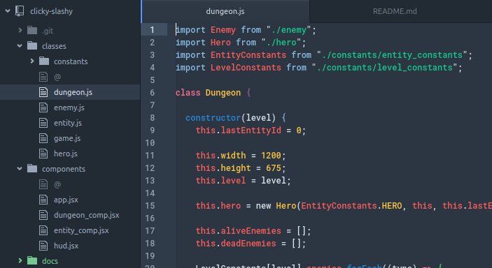
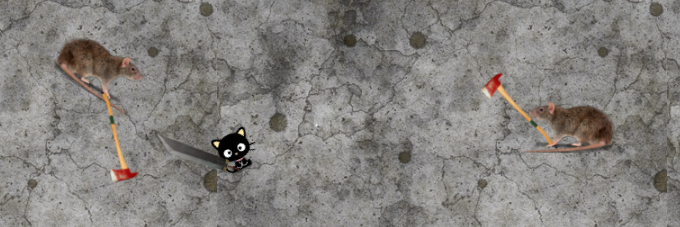
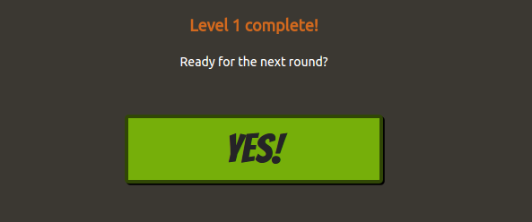
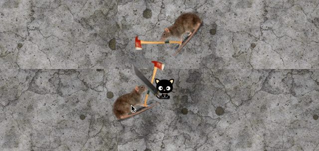

# [clicky-slashy: a dungeon game](http://clicky-slashy.rocks)

![clicky-slashy header image][header_img]

[clicky-slashy live][live]

**clicky-slashy** is a roguelike hack 'n slash game built using React.js, HTML5 and CSS.


## Features

### Object-Oriented Design



The design of clicky-slashy was split into two main parts: game logic and React components.

The game logic is a collection of JS classes (game, dungeon, entity, enemy and hero) that handle the decision-making at each re-render. This includes checking for game state (Level Complete, Game Over, Game Complete), handling entity (hero or enemy) move and attack logic.

React components serve as a mirror image to the game classes, providing the visual elements of the game.

A collection of constants serve as the definitions of the varied entity stats. This allows different enemy types to utilize the same base `entity` class which receives an options hash on initialization.


```js
// entity_constants.js
GRUB: {
  // base
  name: "Grub",
  hp  : 30,
  atk : 5,
  spd : 0.075,
  agl : 5000,
  pcp : 200,
  wpn : WeaponConstants.CROWBAR,
  rad : 50,

  // component refs
  refs: {
    charCSSClass : "grub"
  }
}
```
*Example of an enemy constant object.*

### Efficient Re-renders and Linear Algebra :)

Rather than using a fixed time between re-renders, clicky-slashy uses JavaScript's `window.requestAnimationFrame` to re-render as frequently as possible without putting unnecessary strain on the client. When the callback to `requestAnimationFrame` is invoked, the elapsed time between this and the previous render is calculated and used to determine how much an entity should move.

Each entity has a `spd` (speed) stat, which determines how many pixels it moves per second. A `dir` (direction) variable maintains the entity heading via a normalized 2D vector.

The distance (in pixels) to move at each re-render is determined by the `spd` and elapsed time. The `x` and `y` of the `dir` vector are both multiplied by distance to produce a movement vector. which is added to the current position (x, y coordinate) in the dungeon.


```js
let move = [];
let move[0] = this.dir[0] * this.spd * elapsed;
let move[1] = this.dir[1] * this.spd * elapsed;

let newPos = [this.pos[0] + move[0], this.pos[1] + move[1]];
```
*New position logic for entity classes*

### Enemy AI


*Rats honing in on our brave hero*

Enemy instances are passed a reference to the hero and able to locate our brave hero if the distance between them is less than a certain threshold (defined as `pcp` ("Perception") on the entity class). When the hero is located, a unit vector is calculated to determine the direction the enemy should move to intercept the hero at his/her current position.

### Multi-level gameplay


*A level transition screen*

At each rendering, the game asks the dungeon if all the enemies are dead. If this is true, the dungeon is removed and replaced with a level transition screen. This provides the player a well needed break from clicking and slashing and an opportunity to wipe the sweat from their palms. When the player is ready to resume, they click a button to enter the next level, where a new dungeon with new enemies is instantiated.

### Animations

Each entity class has stats for attack animation duration and hit animation duration. When a hit or attack is initiated, countdown timers are initialized for that event. The entity React component that has the entity class as its prop looks at these timers to determine which CSS classes to apply at each rendering. CSS transition and transform properties provide the slashing 'attack' animation and flashing 'hit' animation..

```css
.weapon.attacking {
  transform: rotate(-45deg);
  transition-property: all;
  transition-duration: .5s;
  transition-timing-function: ease-in-out;
}

.hit {
  -webkit-filter: drop-shadow(0 0 10px rgba(255, 246, 143, 0.9));
  filter: url("./images/cat-hero.png");
  transition: opacity .075s ease-in-out;
}

.hit-bright {
  -webkit-filter: drop-shadow(0 0 10px rgba(255, 255, 255, 1));
  filter: url("./images/cat-hero.png");
  transition: opacity .1s ease-in-out;
}
```
*CSS classes define action animations*


*Our brave hero battles axe-wielding rats*

### The Cat is Adorable
Our brave protagonist is based on my adorable cat Chloe.


*Isn't she pretty?*

[live]: http://clicky-slashy.rocks
[header_img]: docs/images/header.png
